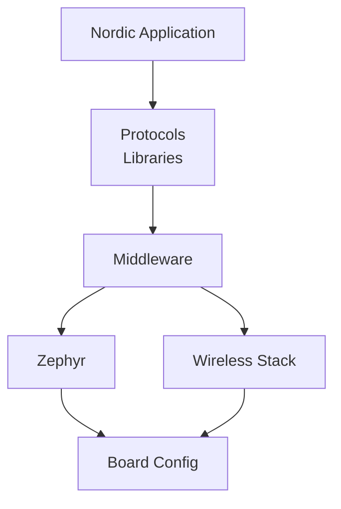
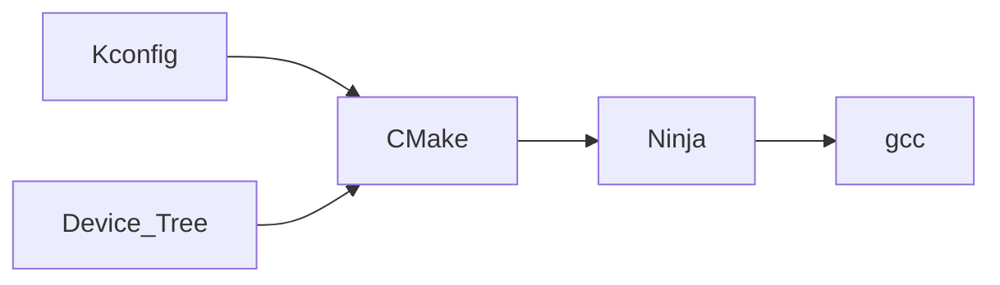

# nrf-devcontainer

Template repository to get started with nRF and Zephyr applications.

---

## nRF toolchain

Nordic provides it's own toolchain manager `nrfutil` it is available in the image.

### Commands

To launch a shell run:

- `nrfutil sdk-manager toolchain launch --ncs-version ${NRF_TOOLCHAIN_VERSION} --shell`

To run arbitary commands run:
- `nrfutil sdk-manager toolchain launch --ncs-version ${NRF_TOOLCHAIN_VERSION} -- which python`

For convenience the `west` alias is added.

### How to use the template

After cloning the repo open the folder in the devconctainer. The build might take some time.
Then run this commands for a quick test:

- Run: `./build_test.sh`
- Run: `west build blinky --board nrf52840dk/nrf52840 --build-dir blinky/build --pristine`


sudo docker run -t -i --privileged -v /dev/bus/usb/:/dev/bus/usb $DOCKERIMAGE_CI bash"
---

## Local devlopment

`curl -d "accept_license_agreement=accepted&submit=Download+software" -X POST -O "https://www.segger.com/downloads/jlink/JLink_Linux_x86_64.deb"`

https://forums.docker.com/t/jlink-segger-inside-ubuntu-container-on-windows-host/122083
Potential workaround:
https://forum.segger.com/index.php/Thread/8953-SOLVED-J-Link-Linux-installer-fails-for-Docker-containers-Error-Failed-to-update/

---

## Refernces

- [Installing the nRF Connect SDK without nrfutil](https://docs.nordicsemi.com/bundle/ncs-latest/page/nrf/installation/install_ncs.html)
- [Using J-Link from docker container](https://kb.segger.com/J-Link_Docker_Container)
- [Memfault Github Actions article](https://interrupt.memfault.com/blog/ncs-github-actions)

## Topics to understand before getting started

### [Workspaces](https://docs.zephyrproject.org/latest/develop/west/workspaces.html#workspaces)

Defines where `west` will find the required dependencies.
A project can be placed in any location of workspace but outside of it.

#### File structure

```bash
zephyrproject/                 # west topdir
├── .west/                     # marks the location of the topdir
│   └── config                 # per-workspace local configuration file
│   # The manifest repository, never modified by west after creation:
├── zephyr/                    # .git/ repo
│   ├── west.yml               # manifest file
│   └── [... other files ...]
│   # Projects managed by west:
├── modules/
│   └── lib/
│       └── zcbor/             # .git/ project
├── tools/
│   └── net-tools/             # .git/ project
└── [ ... other projects ...]
```

- **topdir**  
The `topdir` of a workspace contains the `west.yml` manifest and the `.west` directory.
This is generated with the `west init` command.
- **.west directory**  
west uses this directory to find the workspace. It starts in the `pwd` and then looks a the location set in the `ZEPHYR_BASE` variable.
- **.west/config**  
Here are the settings stored set with the `west config` command. [Documentation](https://docs.zephyrproject.org/latest/develop/west/config.html#west-config)
- **west.yml**  
The manifest file that contains refrences to requiered repositories. Used by `west update` command.

#### [Workspace Topologies](https://docs.zephyrproject.org/latest/develop/west/workspaces.html#topologies-supported)

```bash
west-workspace/
├── app1/               # .git/ project
│   ├── CMakeLists.txt
│   ├── prj.conf
│   └── src/
│       └── main.c
├── app2/               # .git/ project
│   ├── CMakeLists.txt
│   ├── prj.conf
│   └── src/
│       └── main.c
├── manifest-repo/      # .git/ never modified by west
│   └── west.yml        # main manifest with optional import(s) and override(s)
├── modules/
│   └── lib/
│       └── zcbor/      # .git/ project from either the main manifest or
│                       #       from some import
│
└── zephyr/             # .git/ project
    └── west.yml        # This can be partially imported with lower precedence or ignored.
                        # Only the 'manifest-rev' version can be imported.
```

### [Application types](https://docs.zephyrproject.org/latest/develop/application/index.html#application-types)

- **repository**  
An application stored within the `zephyr` directory, e.g. `zephyrproject/zephyr/samples/my-fw`
- **workspace**  
An application stored within the `workspace` but outside the `zephyr` directory.
- **freestanding**  
An application outside of the `workspace`.
[Nordic tutorial](https://docs.nordicsemi.com/bundle/ncs-latest/page/nrf/app_dev/create_application.html#creating_application_for_use_with_command_line)

### Toolchain

#### Architecture





### [West](https://docs.zephyrproject.org/latest/develop/west/index.html)

#### Commands

- `west init`: Creates a west workspace by pulling the requiered `manifest repo`.
- `west update`: Clones and updateds the repositories defined in the `west.yml` manifest.

[West Manifest](https://docs.zephyrproject.org/latest/develop/west/manifest.html)

### [Enviornment Variables](https://docs.zephyrproject.org/latest/develop/application/index.html#important-build-vars)

Can be set in the `~/.zephyrrc` file.  
[Important variables](https://docs.zephyrproject.org/latest/develop/env_vars.html#important-environment-variables)

- `ZEPHYR_BASE`: Directory where the build system can find the `zephyr` directory.
- `CONF_FILE`: Indicates the name of one or more `Kconfig` configuration files.
- `BOARD`: Target board

Other variables:

- `SHIELD`
- `EXTRA_ZEPHYR_MODULES`
- `ZEPHYR_MODULES`
- `ZEPHYR_BOARD_ALIASES`
- `ZEPHYR_SDK_INSTALL_DIR`
- `ZEPHYR_TOOLCHAIN_VARIANT`
- `{TOOLCHAIN}_TOOLCHAIN_PATH`

### [Devicetree](https://docs.zephyrproject.org/latest/build/dts/index.html#devicetree)

### Kconfig

### Application structure

```bash
# From the zephyr documentation
<app>
├── CMakeLists.txt
├── app.overlay
├── prj.conf
├── VERSION
└── src
    └── main.c

# When using nordic vscode extension
blinky/
├── boards
│   └── nrf54l15dk_nrf54l15_cpuapp_hpf_gpio.overlay
├── CMakeLists.txt
├── prj.conf
├── README.rst
├── sample.yaml
└── src
    └── main.c
```

- **CMakeLists.txt:** Contains information requiered for `CMake`
- **app.overlay:** Specifies the `Devictree`.  
        When the nrf-vscode extension is used to create a build configuration the file will be located here `boards/nrf54l15dk_nrf54l15_cpuapp_hpf_gpio.overlay`
- **prj.conf:** [Kconfig file](https://docs.zephyrproject.org/latest/develop/application/index.html#kconfig-configuration)
- **README.rst:** ??
- **sample.yaml:** ??
